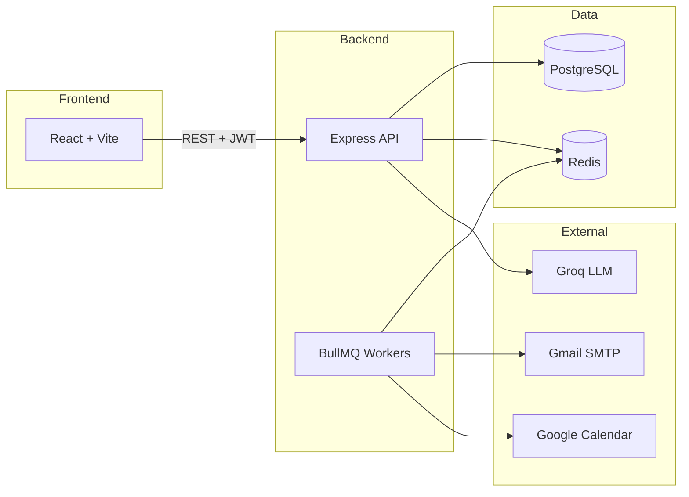
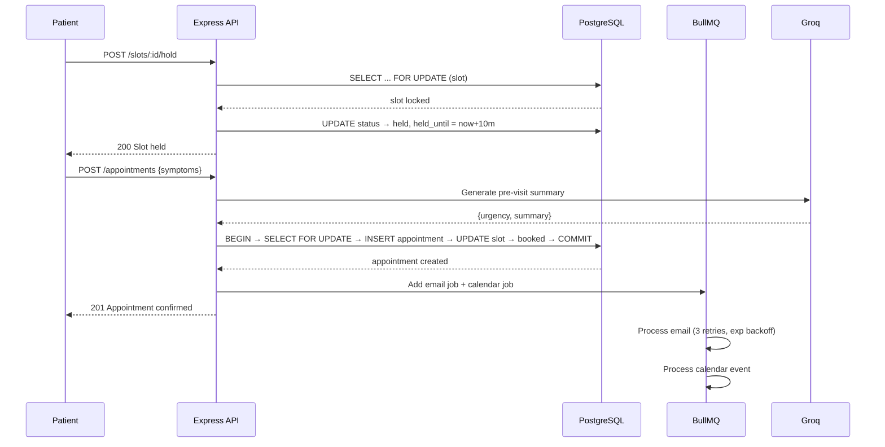
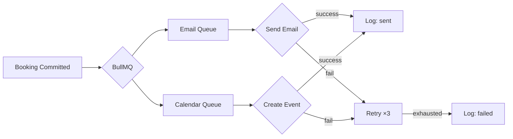

# System Design — Healthcare Appointment Platform

## Architecture Overview

A three-tier web application: React frontend with role-based portals (Patient, Doctor, Admin), a Node.js REST API, and PostgreSQL as the source of truth. BullMQ + Redis power background jobs for emails, calendar sync, slot expiry, and medication reminders.

## Double-Booking Prevention

Two patients must never book the same slot. A naive read-then-write fails under concurrency — both read `available`, both write a booking. The fix: PostgreSQL `SELECT ... FOR UPDATE` inside an explicit transaction. The first transaction acquires a row lock; concurrent ones queue behind it. Once the first commits `booked`, subsequent transactions read the updated status and receive an error. Race conditions are eliminated at the database level.

## Slot Booking Flow

## Slot Hold Mechanism

The `slots` table has statuses: `available`, `held`, `booked`, `cancelled`, plus a `held_until` timestamp. Selecting a slot transitions it to `held` for 10 minutes. A BullMQ cron job runs every 60 seconds, releasing expired holds back to `available`. This prevents indefinite locks while giving patients time to fill the symptom form.

## Doctor Leave Conflict Handling

When an admin marks a leave date, the system queries all confirmed appointments for that doctor on that date. For each: status is set to `cancelled`, a cancellation email is queued, and the Google Calendar event is deleted. The leave record is written only after all conflicts are resolved — ensuring no orphaned bookings. Email dispatch is queued so SMTP outages don't block the operation.

## Notification Pipeline

Notifications are fully decoupled from booking transactions. After a successful DB commit, jobs are pushed to separate BullMQ queues. Each job retries 3 times with exponential backoff. Every attempt is logged to `notification_log` with status (`pending`, `sent`, `failed`) and attempt count.

This ensures: a failing mail provider never rolls back a valid booking; transient failures self-heal; persistent failures are auditable.

## LLM Integration and Failure Handling

Pre-visit summaries are generated after the patient submits symptoms. If the LLM call fails, a structured fallback is stored — urgency `Medium`, three generic questions, and a `generated: false` flag. The doctor portal shows a visible indicator. Post-visit summaries follow the same pattern: on failure, raw notes are shown directly. The system never breaks due to an external AI dependency.

## Database Design Choices

Slots are pre-generated per doctor schedule rather than derived at query time, enabling `FOR UPDATE` locks. Prescriptions are JSONB arrays — structured enough for medication reminders, flexible for variable drug lists. The `notification_log` table separates operational state from business state, serving as both audit trail and retry source.

## Security

JWT tokens carry the user's role. Every protected route passes through role-guard middleware that validates before reaching the controller. Passwords are hashed with bcrypt (12 rounds). Rate limiting (100 req/15 min) and Helmet headers are applied globally. Google OAuth refresh tokens are stored per-user and scoped to that user's Calendar operations only.
